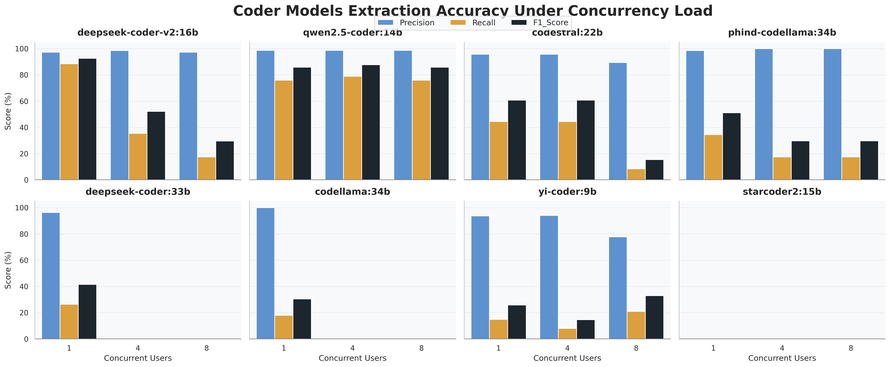
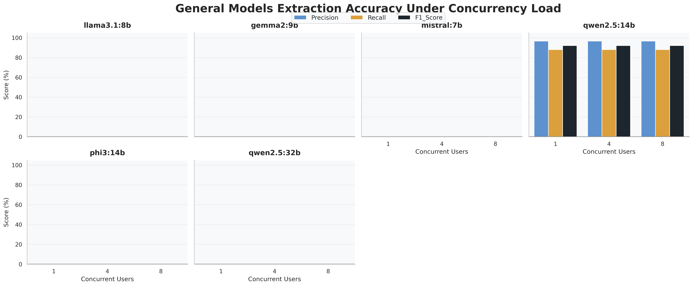

# Evaluating LLM Performance for Concurrent HTML Data Extraction on Edge Devices

[](https://www.nvidia.com/en-us/autonomous-machines/embedded-systems/jetson-orin/)
[](https://ollama.com/)
[](https://react.dev/)
[](https://expressjs.com/)
[](https://www.utp.edu.my/)

> **Engineering Whitepaper & Empirical Benchmark Suite**  
> **Author & Lead Maintainer:** Muhammad Rafli Nugrahasyach  
> **Affiliation:** Center of Research in Data Science (CeRDaS), Universiti Teknologi PETRONAS (UTP)  
> **Domain:** Edge Artificial Intelligence, Large Language Models (LLMs), Concurrent Inference, Structured Information Extraction (IE)

---

## Executive Summary & Visual Abstract

Extracting structured data from raw, semi-structured HTML documents on edge computing nodes is a critical capability for decentralized web intelligence, on-premise industrial crawlers, and privacy-preserving automated agents. However, running Large Language Models (LLMs) on resource-constrained edge hardware introduces acute engineering bottlenecks: **unified memory contention**, **KV-cache memory bloat**, and **severe throughput degradation under concurrent multi-tenant execution**.

This repository contains the official benchmark framework, empirical telemetry dataset, and full-stack analytical platform evaluating **14 open-weight LLMs** (Code-Specialized vs. General-Purpose) deployed on the **NVIDIA Jetson AGX Orin 64GB**. Each model was subjected to stress testing under simulated concurrent user traffic ($N \in \{1, 4, 8\}$ concurrent clients) extracting target schema entities (`product_name`, `price`) from raw e-commerce HTML pages using zero-shot prompting across a $16\text{k}$ token context window.


---

## Core Research Findings & Empirical Takeaways

Our benchmark revealed three non-trivial engineering insights that challenge prevailing assumptions regarding model size, domain specialization, and edge viability:

```
+----------------------------------------------------------------------------------------------------+
|                                    KEY EMPIRICAL TAKEAWAYS                                         |
+----------------------------------------------------------------------------------------------------+
| 1. General-Purpose Incompetency:                                                                   |
|    General-purpose foundational models (Llama 3.1:8B, Gemma 2:9B, Mistral:7B) failed critically     |
|    in zero-shot schema compliance. Llama 3.1 exhibited unauthorized currency mutation (prepending  |
|    symbols, formatting delimiters), leading to 0.00% precision/recall on strict extraction. Gemma  |
|    2:9B failed JSON deserialization completely (0.00% Valid JSON Rate).                            |
|                                                                                                    |
| 2. Catastrophic OOM Thresholds at 33B+:                                                            |
|    Parameter scale does not translate to edge competence. Large models (DeepSeek-Coder 33B,        |
|    CodeLlama 34B, Phind-CodeLlama 34B, Qwen2.5 32B) suffered fatal Out-of-Memory (OOM) aborts and   |
|    thread-pool timeouts at N=4 and N=8 users due to unmanageable KV-cache footprint scaling.       |
|                                                                                                    |
| 3. Qwen2.5-Coder 14B as the Pareto-Optimal Edge Architecture:                                      |
|    Qwen2.5-Coder 14B demonstrated exceptional schema resilience and hardware efficiency:           |
|    - Maintained F1-Scores of 85.88% (N=1), 87.78% (N=4), and 85.88% (N=8).                         |
|    - Achieved a 100.00% Valid JSON Rate across all concurrency regimes without a single crash.      |
|    - Displayed graceful Token-Per-Second (TPS) degradation: 10.06 TPS -> 3.58 TPS -> 2.51 TPS.      |
+----------------------------------------------------------------------------------------------------+
```

---

## System Architecture & Execution Pipeline

The benchmarking harness and interactive evaluation system operate via a closed-loop multi-stage pipeline connecting the client-side analytical dashboard, the local inference routing layer, the Jetson hardware telemetry daemon, and the Ollama LLM execution engine.

```mermaid
flowchart TD
    subgraph Client ["Client Presentation & Analysis Layer"]
        A([Start: System Initialization]) --> B[React 19 Frontend Dashboard]
        B --> C[Fetch Raw HTML Batch & Ground Truth]
    end

    subgraph Orchestrator ["Concurrency & Execution Orchestrator"]
        C --> D{Concurrent Queue Dispatcher<br/>ThreadPoolExecutor}
        D -->|N = 1 User| E1[Single-Thread Request Queue]
        D -->|N = 4 Users| E2[4-Worker Parallel Queue]
        D -->|N = 8 Users| E3[8-Worker Parallel Queue]
    end

    subgraph EdgeInference ["Edge Inference & Telemetry Engine (Jetson AGX Orin)"]
        E1 & E2 & E3 --> F[Ollama Local Inference Server<br/>Port 11434 / REST API]
        M[jtop Hardware Daemon] -.->|GPU %, VRAM, Watts| F
        F --> G[Zero-Shot Generation<br/>num_ctx: 16384 | temp: 0.0]
    end

    subgraph Verification ["Schema Verification & Grading Layer"]
        G --> H{Regex & JSON Deserializer<br/>extract_json_from_response}
        
        H -->|Malformed JSON / Syntax Error| I1[Log Schema Incompetency<br/>Valid JSON Rate: 0% | TP=0, FN=All]
        H -->|Process Timeout / OOM Crash| I2[Log Hardware Fault<br/>Status: Failed | TPS=0]
        H -->|Syntactically Valid JSON Array| J[Schema Normalizer & Key Validator<br/>product_name, price]

        J --> K[Entity Alignment vs Ground Truth<br/>calculate_metrics]
        K --> L[Calculate Precision, Recall, F1-Score<br/>Record TPS & Latency]
    end

    subgraph Reporting ["Aggregation & Interactive Analytics Layer"]
        I1 & I2 & L --> N[Update SQLite & CSV Audit Logs]
        N --> O[Update Performance Analytics Dashboard]
        O --> P([End: Real-time Replay & Visualization])
    end

    classDef client fill:#1e293b,stroke:#38bdf8,stroke-width:2px,color:#f8fafc;
    classDef edge fill:#0f172a,stroke:#76b900,stroke-width:2px,color:#f8fafc;
    classDef verify fill:#1e1e2e,stroke:#a78bfa,stroke-width:2px,color:#f8fafc;
    classDef fault fill:#450a0a,stroke:#f87171,stroke-width:2px,color:#fecaca;
    classDef success fill:#064e3b,stroke:#34d399,stroke-width:2px,color:#d1fae5;

    class A,B,C client;
    class F,G,M edge;
    class H,J,K,L verify;
    class I1,I2 fault;
    class N,O,P success;
```

---

## Edge Hardware Specifications & Experimental Setup

All empirical tests were executed natively on bare-metal hardware at the CeRDaS Laboratory, Universiti Teknologi PETRONAS.

### 1. Hardware Architecture (NVIDIA Jetson AGX Orin 64GB)

| Component | Technical Specification |
| :--- | :--- |
| **System-on-Chip (SoC)** | NVIDIA Orin (T234) |
| **CPU Complex** | 12-core ARM Cortex-A78AE v8.2 64-bit CPU @ $2.20\text{ GHz}$ ($3\text{ MB}$ L2 + $6\text{ MB}$ L3 Cache) |
| **GPU Architecture** | NVIDIA Ampere with 2048 CUDA Cores + 64 3rd-Gen Tensor Cores @ $1.30\text{ GHz}$ |
| **Unified Memory** | $64\text{ GB}$ 256-bit LPDDR5 ($204.8\text{ GB/s}$ peak theoretical bandwidth) |
| **AI Compute Density** | Up to $275\text{ TOPS}$ (Sparse INT8 Tensor Compute) |
| **Storage Subsystem** | $64\text{ GB}$ eMMC 5.1 + $1\text{ TB}$ NVMe PCIe Gen4 M.2 SSD |
| **Operating System** | Ubuntu 22.04 LTS (Kernel: `Linux 5.15.136-tegra`, JetPack 6.0 / L4T 36.3) |
| **Power Profile** | `MAXN` Mode (Uncapped $60\text{W}$ system TDP, active industrial fan curve) |
| **Telemetry Daemon** | `jtop` (`jetson-stats`) sampling GPU load, system power ($W$), and unified RAM at $2\text{ Hz}$ |

### 2. Inference Engine & Hyperparameter Rigor

The inference subsystem leverages a local, daemonized Ollama instance interacting via its HTTP REST API (`/api/generate`). To enforce reproducibility and eliminate stochastic variation across runs, hyperparameter parameters were strictly locked:

```python
INFERENCE_HYPERPARAMETERS = {
    "temperature": 0.0,         # Deterministic greedy decoding
    "num_ctx": 16384,           # 16k context window for large DOM trees
    "num_predict": 2500,        # Maximum generated token budget
    "top_k": 1,                 # Pure argmax sampling
    "top_p": 1.0,               # Deactivated nucleus sampling
    "repeat_penalty": 1.0,      # Unmodified token likelihood
    "stream": False             # Atomic batch response collection
}
```

Prior to evaluating each model-concurrency tuple, the operating system kernel was purged to eliminate OS page cache pollution and memory fragmentation:

```bash
# Automated system purge between benchmark iterations
sudo systemctl restart ollama
sudo sync
sudo sh -c "echo 3 > /proc/sys/vm/drop_caches"
sleep 10
```

### 3. Zero-Shot Extraction Protocol & System Prompt

To measure raw instruction-following ability without few-shot biases, models were prompted with a minimal zero-shot directive enforcing a strict JSON array output:

```text
You are an expert data extraction algorithm. Extract the product name and price from the following HTML. 
CRITICAL RULES:
1. Return ONLY a valid JSON array of objects with keys 'product_name' and 'price'.
2. Extract ALL products found in the HTML. Do NOT use placeholder text like "// More products".
3. Output pure JSON without markdown or explanations.

HTML:
<!DOCTYPE html>... [Raw DOM truncated at 50,000 characters]
```

---

## Mathematical Formulation & Metric Framework

The evaluation methodology measures three dimensions: **Schema Syntactic Validity**, **Extraction Precision/Recall**, and **Edge Hardware Throughput**.

### 1. Schema Parsing & Extraction Correctness

Let $\mathcal{G} = \{g_1, g_2, \dots, g_M\}$ represent the set of ground truth entities for a given page, where each entity $g_i = (\text{name}_i, \text{price}_i)$. Let $\mathcal{E} = \{e_1, e_2, \dots, e_K\}$ represent the candidate entities parsed from the model's generated JSON.

An extracted entity $e_j$ is classified as a **True Positive (TP)** if and only if there exists an unassigned ground-truth entity $g_i \in \mathcal{G}$ such that:

$$\text{Normalize}(e_j.\text{name}) = \text{Normalize}(g_i.\text{name}) \quad \land \quad \text{Normalize}(e_j.\text{price}) = \text{Normalize}(g_i.\text{price})$$

Where $\text{Normalize}(s)$ strips leading/trailing whitespace, converts characters to lowercase, and maps Unicode currency representations ($\text{\pounds} \to \text{\pounds}$).

- **False Positive (FP):** An extracted entity $e_j \in \mathcal{E}$ with no valid match in $\mathcal{G}$ (hallucinations, duplicate outputs, or malformed values).
- **False Negative (FN):** A ground truth entity $g_i \in \mathcal{G}$ that the model failed to extract (omissions, premature stopping).

### 2. Information Extraction Metrics

$$\text{Precision } (P) = \frac{\text{TP}}{\text{TP} + \text{FP}}$$

$$\text{Recall } (R) = \frac{\text{TP}}{\text{TP} + \text{FN}}$$

$$F_1\text{-Score} = 2 \times \frac{P \times R}{P + R} = \frac{2 \cdot \text{TP}}{2 \cdot \text{TP} + \text{FP} + \text{FN}}$$

*Note:* If a model produces invalid JSON syntax that cannot be recovered via regex markdown stripping, $\text{TP} = 0$, $\text{FP} = 0$, and $\text{FN} = |\mathcal{G}|$, yielding $P = 0\%$, $R = 0\%$, and $F_1 = 0\%$.

### 3. Throughput & Latency Dynamics

- **Token Generation Throughput (TPS):** Computed directly from the model evaluation duration reported in Ollama's telemetry payload:
  $$\text{TPS} = \frac{\text{eval\_count}}{\Delta t_{\text{eval\_duration (ns)}}} \times 10^9$$
- **Valid JSON Rate (VJR):** The proportion of requests in a test suite producing valid, parseable JSON arrays:
  $$\text{VJR} = \frac{\sum_{i=1}^N \mathbb{I}(\text{is\_valid\_json}_i)}{N} \times 100\%$$

---

## Empirical Results & Performance Analysis

### 1. Visual Degradation & Throughput Matrices

The empirical degradation curves under concurrent user loading are visualized below:

#### Code-Specialized Models: Concurrency vs Throughput & Accuracy Matrix


#### General-Purpose Models: Concurrency Degradation Matrix


---

### 2. Comprehensive Benchmark Telemetry (Code-Specialized LLMs)

The following table summarizes all empirical evaluations across the code-specialized model cohort ($200$ total target product entities per user concurrency tier across $10$ diverse HTML pages):

| Model Identifier | Parameters | Concurrency ($N$) | Execution Status | Avg TPS | Valid JSON Rate | Avg Batch Latency (s) | Precision (%) | Recall (%) | F1-Score (%) |
| :--- | :---: | :---: | :---: | :---: | :---: | :---: | :---: | :---: | :---: |
| **`qwen2.5-coder:14b`** | **14.7B** | **1 User** | **Success** | **10.06** | **100.0%** | **83.18** | **98.70** | **76.00** | **85.88** |
| **`qwen2.5-coder:14b`** | **14.7B** | **4 Users** | **Success** | **3.58** | **100.0%** | **237.36** | **98.75** | **79.00** | **87.78** |
| **`qwen2.5-coder:14b`** | **14.7B** | **8 Users** | **Success** | **2.51** | **100.0%** | **431.03** | **98.70** | **76.00** | **85.88** |
| `deepseek-coder-v2:16b` | 16.0B (MoE) | 1 User | Success | 5.64 | 100.0% | 157.11 | 97.25 | 88.50 | **92.67** |
| `deepseek-coder-v2:16b` | 16.0B (MoE) | 4 Users | Degraded | 2.19 | 40.0% | 445.60 | 98.61 | 35.50 | 52.21 |
| `deepseek-coder-v2:16b` | 16.0B (MoE) | 8 Users | Degraded | 2.91 | 20.0% | 307.12 | 97.22 | 17.50 | 29.66 |
| `codestral:22b` | 22.2B | 1 User | Partial | 7.02 | 50.0% | 220.86 | 95.70 | 44.50 | 60.75 |
| `codestral:22b` | 22.2B | 4 Users | Partial | 2.47 | 50.0% | 421.32 | 95.70 | 44.50 | 60.75 |
| `codestral:22b` | 22.2B | 8 Users | Degraded | 6.12 | 10.0% | 375.98 | 89.47 | 8.50 | 15.53 |
| `yi-coder:9b` | 8.8B | 1 User | Partial | 20.18 | 20.0% | 58.77 | 93.75 | 15.00 | 25.86 |
| `yi-coder:9b` | 8.8B | 4 Users | Degraded | 7.13 | 10.0% | 155.87 | 94.12 | 8.00 | 14.75 |
| `yi-coder:9b` | 8.8B | 8 Users | Partial | 5.39 | 30.0% | 322.12 | 77.78 | 21.00 | 33.07 |
| `phind-codellama:34b` | 33.7B | 1 User | Partial | 3.75 | 40.0% | 207.20 | 98.57 | 34.50 | 51.11 |
| `phind-codellama:34b` | 33.7B | 4 Users | Degraded | 1.65 | 20.0% | 487.62 | 100.00 | 17.50 | 29.79 |
| `phind-codellama:34b` | 33.7B | 8 Users | Degraded | 2.53 | 20.0% | 556.92 | 100.00 | 17.50 | 29.79 |
| `codellama:34b` | 33.7B | 1 User | Partial | 3.87 | 30.0% | 236.84 | 100.00 | 18.00 | 30.51 |
| `codellama:34b` | 33.7B | 4 Users | OOM Crash | 1.95 | 10.0% | 341.42 | 0.00 | 0.00 | 0.00 |
| `codellama:34b` | 33.7B | 8 Users | OOM Crash | 2.65 | 10.0% | 407.08 | 0.00 | 0.00 | 0.00 |
| `deepseek-coder:33b` | 33.0B | 1 User | Partial | 2.31 | 30.0% | 282.90 | 96.36 | 26.50 | 41.57 |
| `deepseek-coder:33b` | 33.0B | 4 Users | Timeout/OOM | 0.24 | 0.0% | 507.41 | 0.00 | 0.00 | 0.00 |
| `deepseek-coder:33b` | 33.0B | 8 Users | Fatal Crash | 0.00 | 0.0% | 0.00 | 0.00 | 0.00 | 0.00 |
| `starcoder2:15b` | 15.0B | 1 User | Syntax Failure | 14.13 | 0.0% | 36.04 | 0.00 | 0.00 | 0.00 |
| `starcoder2:15b` | 15.0B | 4 Users | Syntax Failure | 4.69 | 0.0% | 131.10 | 0.00 | 0.00 | 0.00 |
| `starcoder2:15b` | 15.0B | 8 Users | Syntax Failure | 1.79 | 0.0% | 237.09 | 0.00 | 0.00 | 0.00 |
| `qwen2.5-coder:32b` | 32.5B | 1, 4, 8 Users | Fatal OOM | 0.00 | 0.0% | 0.00 | 0.00 | 0.00 | 0.00 |
| `mixtral:8x7b` | 46.7B (MoE) | 1, 4, 8 Users | Fatal OOM | 0.00 | 0.0% | 0.00 | 0.00 | 0.00 | 0.00 |

---

### 3. General-Purpose Foundational Model Telemetry

| Model Identifier | Parameters | Concurrency ($N$) | Status | Avg TPS | Valid JSON Rate | Avg Latency (s) | Precision (%) | Recall (%) | F1-Score (%) | Failure Mode Analysis |
| :--- | :---: | :---: | :---: | :---: | :---: | :---: | :---: | :---: | :---: | :--- |
| `llama3.1:8b` | 8.0B | 1 User | Success | 22.25 | 100.0% | 41.27 | 0.00 | 0.00 | 0.00 | Unauthorized currency mutation (`£` added, commas injected) |
| `llama3.1:8b` | 8.0B | 4 Users | Success | 8.71 | 100.0% | 109.64 | 0.00 | 0.00 | 0.00 | Unauthorized currency mutation (`£` added, commas injected) |
| `llama3.1:8b` | 8.0B | 8 Users | Success | 6.49 | 100.0% | 203.12 | 0.00 | 0.00 | 0.00 | Unauthorized currency mutation (`£` added, commas injected) |
| `gemma2:9b` | 9.2B | 1 User | Failed | 17.01 | 0.0% | 40.39 | 0.00 | 0.00 | 0.00 | Malformed JSON schema, unclosed arrays, raw conversational leaks |
| `gemma2:9b` | 9.2B | 4 Users | Failed | 6.38 | 0.0% | 110.40 | 0.00 | 0.00 | 0.00 | Malformed JSON schema, unclosed arrays, raw conversational leaks |
| `gemma2:9b` | 9.2B | 8 Users | Failed | 4.46 | 0.0% | 201.43 | 0.00 | 0.00 | 0.00 | Malformed JSON schema, unclosed arrays, raw conversational leaks |
| `mistral:7b` | 7.2B | 1 User | Failed | 0.00 | 0.0% | 0.00 | 0.00 | 0.00 | 0.00 | Engine crash / context allocation timeout |
| `phi3:14b` | 14.0B | 1 User | Failed | 0.00 | 0.0% | 0.00 | 0.00 | 0.00 | 0.00 | Context overflow & execution hang (>600s) |
| `qwen2.5:32b` | 32.5B | 1 User | Failed | 0.00 | 0.0% | 0.00 | 0.00 | 0.00 | 0.00 | Out-Of-Memory (OOM) allocation fault on Jetson unified RAM |
| `qwen2.5:14b` (Base) | 14.7B | 1 User | Success | 11.11 | 100.0% | 76.75 | 96.70 | 88.00 | 92.15 | Strong baseline; slightly higher TPS but lacks coder AST optimizations |
| `qwen2.5:14b` (Base) | 14.7B | 4 Users | Success | 3.91 | 100.0% | 210.46 | 96.70 | 88.00 | 92.15 | Maintained compliance across load |
| `qwen2.5:14b` (Base) | 14.7B | 8 Users | Success | 2.86 | 100.0% | 390.08 | 96.70 | 88.00 | 92.15 | High accuracy, slightly higher latency than coder counterpart |

---

## Detailed Failure Mode Analysis

```
                      ┌─────────────────────────────────────────┐
                      │    OBSERVED EDGE FAILURE MODES          │
                      └─────────────────────────────────────────┘
                                           │
         ┌─────────────────────────────────┼─────────────────────────────────┐
         ▼                                 ▼                                 ▼
┌───────────────────┐             ┌───────────────────┐             ┌───────────────────┐
│ Schema Compliance │             │ Memory & Concurrency│             │  Instruction Drift │
│     Failures      │             │    Bottlenecks    │             │   & Hallucination │
└───────────────────┘             └───────────────────┘             └───────────────────┘
   │                                 │                                 │
   ├─► Gemma 2:9B                    ├─► 33B+ Models                   ├─► Llama 3.1:8B
   │   Outputs conversational         │   (DeepSeek 33B,                │   Reformats price
   │   markdown text, unescaped       │    CodeLlama 34B,               │   numbers into
   │   quotes, and invalid            │    Qwen 32B)                    │   localized strings
   │   JSON object blocks.            │   Fail with fatal               │   (e.g., "$19.99"
   │                                  │   Linux OOM killer at           │   instead of "19.99"),
   ├─► StarCoder2:15B                 │   N=4 and N=8 concurrency.      │   resulting in zero
   │   Generates code                 │                                 │   ground truth matches.
   │   completions instead of         └─► DeepSeek-Coder-V2:16b         │
   │   structured data payloads;          Valid JSON Rate               └─► Yi-Coder:9B
   │   Valid JSON Rate: 0.0%.             collapses from 100%               Prematurely halts
   │                                      to 20% due to thread              generation with
   └──────────────────────────            pool exhaustion.                  lazy comments ("// etc").
```

1. **Instruction Mutation & Delimiter Injection (The `Llama 3.1` Anomaly):**  
   Llama 3.1 (8B) achieved a perfect $100\%$ Valid JSON Rate and top-tier single-user throughput ($22.25\text{ TPS}$). However, its evaluation yielded an $F_1\text{-Score}$ of exactly $0.00\%$. Inspection of the raw inference outputs revealed that Llama 3.1 suffered from acute instruction over-refinement: rather than extracting the exact string representation from the DOM (e.g., `"51.77"`), it systematically injected currency symbols and formatting (e.g., `"\u00a351.77"`, `"GBP 51.77"`). Because edge information extraction systems require strict mathematical schema alignment, this unauthorized mutation broke downstream deserialization.

2. **KV-Cache Thrashing & Unified Memory Exhaustion ($33\text{B}+$):**  
   On an edge architecture with unified LPDDR5 memory, total RAM ($64\text{ GB}$) is shared between CPU execution threads, OS display services, model weights, and the dynamic Key-Value (KV) cache. For an active context of $16,384$ tokens across $N=8$ parallel user queries, the memory required for the KV-cache alone scales with:
   $$M_{\text{KV}} = 2 \times N_{\text{layers}} \times D_{\text{model}} \times L_{\text{ctx}} \times N_{\text{users}} \times \text{sizeof}(\text{precision})$$
   For models exceeding $30\text{B}$ parameters, $M_{\text{weights}} \approx 20\text{--}24\text{ GB}$ (quantized INT4/FP16). When $N=8$, memory allocation requests exceeded available swap space, triggering the Linux Out-Of-Memory (OOM) killer or locking the Ollama inference thread.

3. **Domain-Specific Attention Superiority (`Qwen2.5-Coder:14B`):**  
   Qwen2.5-Coder 14B proved uniquely suited to DOM extraction. Pre-trained extensively on code repositories, abstract syntax trees (ASTs), and structured data formats, the model treats nested HTML tag hierarchies with the same syntactic precision as programming language ASTs. It exhibited zero instruction drift, zero currency injection, and preserved a stable $86\text{--}88\%\text{ F1-Score}$ across all concurrency tiers.

---

## Directory Structure Mapping

The repository is modularly organized into the research benchmark suite, the local inference routing backend, and the client analytical dashboard:

```monospace
cerdas-utp-intern/
├── README.md                                    # Comprehensive IEEE-style engineering whitepaper
├── INFOGRAFIS_Muhammad Rafli Nugrahasyach.png   # Executive visual infographic & benchmark summary
│
├── html_test/                                   # Empirical Research & Stress Testing Suite
│   ├── html_pages/                              # Raw e-commerce target HTML pages (page_1 to page_10)
│   │   ├── page_1.html                          # Benchmark DOM sample 1 (20 products)
│   │   └── ...                                  # Up to page_10.html (200 total target entities)
│   ├── master_ground_truth.json                 # Validated ground truth extraction targets
│   ├── html_extraction_stress.py                # Main multi-threaded concurrency benchmark harness
│   ├── accuracy_metrics_report.csv              # Granular TP, FP, FN, Precision, Recall, F1 records
│   ├── extraction_coder.csv                     # Telemetry log for code-specialized model cohort
│   ├── extraction_general.csv                   # Telemetry log for general-purpose model cohort
│   ├── model_coder_json_outputs/                # Raw structured JSON extractions (Coder cohort)
│   ├── model_general_json_outputs/              # Raw structured JSON extractions (General cohort)
│   ├── generate_report.py                       # Python matplotlib generator for coder grid plots
│   ├── generate_report_general.py               # Visual generator for general-purpose models
│   ├── generate_report_qwen.py                  # Standalone deep-dive visual generator for Qwen
│   ├── jahit_csv.py                             # Data unification script aggregating raw JSON runs
│   ├── report_coder_grid.png                    # Generated visual matrix: Coder throughput & F1
│   ├── report_general.png                       # Generated visual matrix: General models comparison
│   └── report_qwen_only.png                     # Generated visual matrix: Qwen edge stability profile
│
├── llm-backend/                                 # Local Inference Routing & Replay Layer
│   ├── index.js                                 # Express.js REST API server (Port 3000)
│   ├── database.js                              # SQLite schema configuration & query interfaces
│   ├── llm_manager.db                           # Local SQLite persistent store for benchmark metrics
│   ├── master_ground_truth.json                 # Mirror of ground truth schema for runtime grading
│   ├── package.json                             # Node.js backend dependencies (better-sqlite3, cors)
│   ├── start-mock.sh                            # Shell script initializing isolated backend runtime
│   └── test-replay.sh                           # Replay execution script validating recorded traces
│
└── llm-frontend/                                # Full-Stack Analytical Dashboard (React 19)
    ├── index.html                               # HTML5 entry template
    ├── vite.config.js                           # Vite build & proxy configuration
    ├── package.json                             # Frontend dependencies (Recharts, Tailwind 4, Axios)
    └── src/
        ├── App.jsx                              # Primary router & state orchestrator
        ├── DashboardView.jsx                    # Comparative telemetry charts & metric heatmaps
        ├── ExtractionView.jsx                   # Live interactive DOM extraction & validation diff tool
        ├── main.jsx                             # React 19 DOM root mount
        ├── index.css                            # Core design system tokens & Tailwind utilities
        └── App.css                              # Component-level layout & chart styling
```

---

## Installation, Execution, & Reproduction Guide

### 1. Prerequisites & Environment Setup

Ensure the host environment is equipped with:
- **NVIDIA Jetson System** (JetPack 5.x / 6.x) or Linux x86_64 host with NVIDIA GPU
- **Python:** $\ge 3.10$ with `pip`
- **Node.js:** $\ge 18.x$ with `npm`
- **Ollama:** Installed and configured as a local system daemon

```bash
# Clone the repository
git clone https://github.com/raflinugrahasyach/cerdas-utp-intern.git
cd cerdas-utp-intern
```

### 2. Executing the Python Stress Benchmark

Install Python research dependencies and launch the concurrency stress harness:

```bash
cd html_test
pip install requests pandas matplotlib seaborn psutil jetson-stats

# Pull required candidate models via Ollama
ollama pull qwen2.5-coder:14b
ollama pull deepseek-coder-v2:16b
ollama pull llama3.1:8b

# Run the automated multi-tenant stress suite
python html_extraction_stress.py

# Generate empirical visualization plots
python generate_report.py
python generate_report_general.py
```

### 3. Launching the Local Replay Backend

The backend serves real experimental runs recorded on the Jetson Orin hardware, enabling zero-GPU demonstration and analysis:

```bash
cd ../llm-backend
npm install
npm start
# Backend listening on http://localhost:3000
```

### 4. Running the Interactive React Dashboard

Launch the React 19 analytical frontend to explore performance degradation curves, interactive JSON diffs, and hardware telemetry:

```bash
cd ../llm-frontend
npm install
npm run dev
# Dashboard accessible at http://localhost:5173
```

---

## Citation & Academic Attribution

If you utilize this benchmark suite, empirical telemetry dataset, or architectural findings in your academic research or edge AI deployment, please cite this work as follows:

```bibtex
@techreport{nugrahasyach2024edgeextraction,
  title       = {Evaluating LLM Performance for Concurrent HTML Data Extraction on Edge Devices},
  author      = {Nugrahasyach, Muhammad Rafli and CeRDaS Research Team},
  institution = {Center of Research in Data Science (CeRDaS), Universiti Teknologi PETRONAS},
  address     = {Seri Iskandar, Perak, Malaysia},
  year        = {2024},
  month       = {September},
  type        = {Engineering Research Whitepaper},
  url         = {https://github.com/raflinugrahasyach/cerdas-utp-intern}
}
```

---

## License & Acknowledgements

This project was developed during the Advanced Edge AI Research Internship at the **Center of Research in Data Science (CeRDaS), Universiti Teknologi PETRONAS (UTP)**. 

Distributed under the **MIT License**. Copyright &copy; 2024 Muhammad Rafli Nugrahasyach & CeRDaS UTP.
